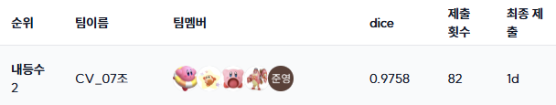
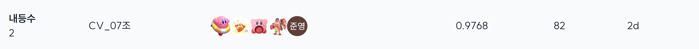

# Hand Bone Image Segmentation

## Team

<table>
  <tr>
    <td align="center">
      <a href="https://github.com/tenaan">
        
        <br />
        <sub><b>안태현</b></sub>
      </a>
      <br />
      <a href="https://github.com/tenaan" title="Code"></a>
    </td>
    <td align="center">
      <a href="https://github.com/jjeongbin0826">
        
        <br />
        <sub><b>최정빈</b></sub>
      </a>
      <br />
      <a href="https://github.com/jjeongbin0826" title="Code"></a>
    </td>
    <td align="center">
      <a href="https://github.com/chocobanana20">
        
        <br />
        <sub><b>이승현</b></sub>
      </a>
      <br />
      <a href="https://github.com/chocobanana20" title="Code"></a>
    </td>
    <td align="center">
      <a href="https://github.com/wooqi00">
        
        <br />
        <sub><b>윤종욱</b></sub>
      </a>
      <br />
      <a href="https://github.com/wooqi00" title="Code"></a>
    </td>
    <td align="center">
      <a href="https://github.com/Jun00511">
        
        <br />
        <sub><b>박준영</b></sub>
      </a>
      <br />
      <a href="https://github.com/Jun00511" title="Code"></a>
    </td>
  </tr>
</table>

## Project Overview

본 프로젝트는 Hand Bone X-ray 이미지를 활용하여 뼈 영역을 정밀하게 분할하는 Bone Segmentation 모델 개발을 목표로 한다. 이를 통해 골절 진단, 수술 계획 수립, 맞춤형 의료 장비 제작 등 의료 현장에서의 진단 정확도와 업무 효율성 향상에 기여하고자 한다.

## Performance

<table>
  <thead>
    <tr>
      <th>Setting</th>
      <th>UperNet</th>
      <th>HRNet</th>
      <th>SwinUNet</th>
    </tr>
  </thead>
  <tbody>
    <tr>
      <td>Base</td>
      <td>0.9487</td>
      <td>0.9642</td>
      <td>0.9447</td>
    </tr>
    <tr>
      <td>Encoder</td>
      <td>0.9493</td>
      <td>-</td>
      <td>-</td>
    </tr>
    <tr>
      <td>Augmentation</td>
      <td>0.9545</td>
      <td>0.9706</td>
      <td>0.9575</td>
    </tr>
    <tr>
      <td>Loss</td>
      <td>0.9557</td>
      <td>0.9709</td>
      <td>0.9545</td>
    </tr>
    <tr>
      <td>Scheduler</td>
      <td>0.9561</td>
      <td>0.9709</td>
      <td>-</td>
    </tr>
    <tr>
      <td>Resize</td>
      <td>0.9743</td>
      <td>-</td>
      <td>-</td>
    </tr>
    <tr>
      <td>TTA</td>
      <td>0.9745</td>
      <td>0.9753</td>
      <td>-</td>
    </tr>
    <tr>
      <td colspan="4" align="center">
        <b>Ensemble (Best): 0.9758</b>
      </td>
    </tr>
  </tbody>
</table>

**Public**  


**Private**  



## 🛠 Ensemble Usage

사용된 모델(HRNet, Swin-Unet, UperNet 등)과 모델별 입력 해상도(1024, 2048 등)를 지원하는 앙상블 스크립트 

- Soft Voting, Hard Voting, TTA(Flip, Contrast) 및 Class-specific Thresholds 적용

### 실행 스크립트 예시 (`run_ensemble.sh`)

아래 스크립트를 `run_ensemble.sh`로 저장하여 실행

모델 가중치 경로와 해상도(`path:size`), 그리고 각 클래스별 임계값(Threshold)을 상황에 맞게 수정해야 함

```bash
#!/bin/bash

export PYTHONPATH=$PYTHONPATH:.

# ================= Configuration =================

MODEL1="outputs/checkpoints/HRNet32_OCR_2048_fold0.pt:2048"
MODEL2="outputs/checkpoints/SWIN_UNET_best_model_1024.pt:1024"
MODEL3="outputs/checkpoints/upernet_2048_flip_best.pt:2048"

MODEL_SCORES="0.9753 0.9575 0.9745"

THRESHOLDS="0.449 0.615 0.611 0.617 0.611 0.524 0.588 0.458 0.566 0.541 \
0.594 0.684 0.759 0.563 0.629 0.555 0.647 0.545 0.593 0.467 \
0.158 0.331 0.542 0.563 0.607 0.597 0.396 0.482 0.799"

VOTING_TYPE="soft"       # 'soft' or 'hard'
BATCH_SIZE=2
OUTPUT_NAME="submission_ensemble.csv"

# ================= Execution =================

echo "Starting Ensemble Inference..."
echo "Models: 3 types | Voting: $VOTING_TYPE"

python -u scripts/ensemble.py \
    --model_configs $MODEL1 $MODEL2 $MODEL3 \
    --model_scores $MODEL_SCORES \
    --voting $VOTING_TYPE \
    --batch_size $BATCH_SIZE \
    --thr $THRESHOLDS \
    --contrast_settings 0.0 -1 \
    --weight_min 0.1 \
    --weight_max 1.0 \
    --use_flip_tta \
    --output_csv $OUTPUT_NAME
```
